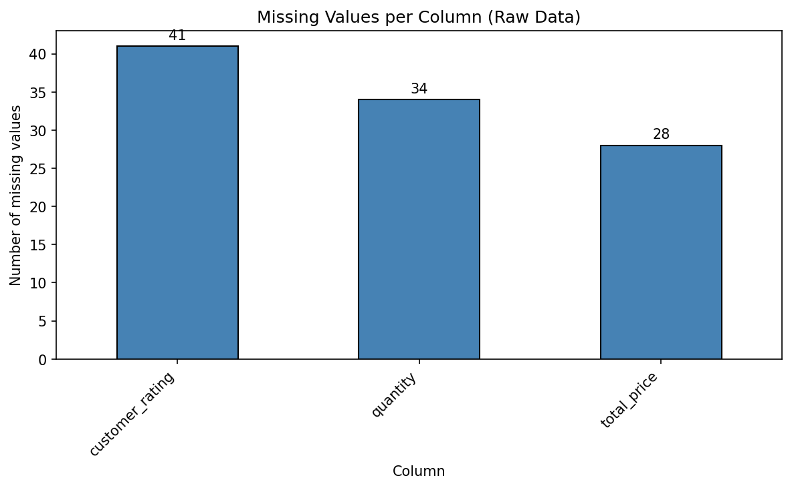
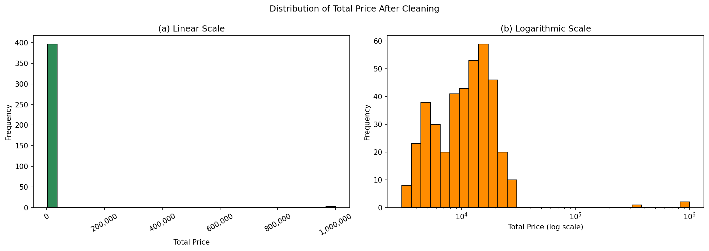
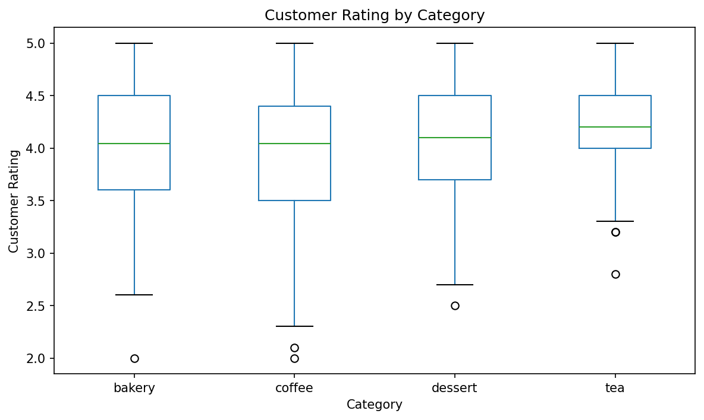

# Lab 1 Report — 20233542 강지은

## 1. What I did
For Figure 2, I extended the histogram by showing `total_price` on both linear and logarithmic scales. This preserves the bulk orders while making ordinary orders easier to examine.

## 2. Results
**Table 1. Key numbers from `results.json`.** The three quantity outliers are bulk orders that explain the long tail in Figure 2.

| Metric | Value |
|--------|-------|
| Rows raw / clean | 412/400 |
| Duplicates removed | 12 |
| Missing values (raw → clean) | 103 → 0 |
| Quantity outliers (IQR) | 3 |
| Top category by revenue | coffee |
| Mean rating (clean) | 4.037 |

## 3. Figures

**Figure 1. Missing values per column.** The raw data contain 41 missing `customer_rating`, 34 missing `quantity`, and 28 missing `total_price` values, suggesting optional feedback and incomplete order entry.

**Figure 2. Distribution of `total_price` after cleaning.** Most totals are low, while a few bulk orders create a long upper tail; the log scale makes ordinary orders clearer. Since bulk orders raise the mean to 17,405, the median of 11,000 better represents a typical order.

**Figure 3. `customer_rating` by category after cleaning.** Tea has the highest mean (4.206) and median (4.20), but it has only 66 observations and substantial overlap with other categories, so its apparent advantage is uncertain.

## 4. Interpretation

The three quantity outliers—150 cheesecakes, 200 lattes, and 120 macarons—have consistent totals, so removing them without evidence is unjustified. Median imputation for 32 missing quantities could hide bulk orders, but Figure 2 is barely affected because only one `total_price` was recalculated. Mean rating imputation (4.04) could overestimate satisfaction and reduce differences in Figure 3. Coffee’s top revenue in Table 1 is supported by its 178 orders, though bulk orders increase its lead.

## 5. Limitations

Because rating nonresponse is unexplained, mean imputation could overestimate satisfaction and distort tea’s apparent advantage in Figure 3.

## AI & external-code usage

| Tool / Source | Part used for | What I modified & verified myself |
| ------------- | ------------- | --------------------------------- |
| Chat GPT | Clarifying requirements, explaining IQR and relevant APIs, reviewing visualizations code, improving report | I implemented the code myself, ran the tests, analyzed the figures and tables |